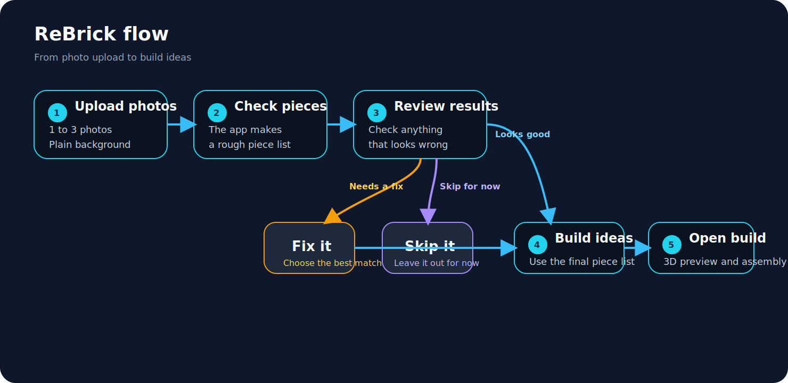

# ReBrick

Reuse and rediscover your old LEGO collection.

## About

I had this idea because a lot of people have buckets of random LEGO pieces and do not know what they can build with them.

This app lets people upload photos of their pieces, fix anything the app got wrong, and get ideas for things they can build.

The goal was to make one simple project where I could work on frontend, backend, computer vision, and 3D visualisation in the same app.

## How it works

1. Upload 1 to 3 photos of loose pieces on a plain background with no overlap.
2. The app checks the photos and makes a rough piece list.
3. If something looks wrong, the user can fix it or skip it.
4. The app uses the final piece list to show build ideas.
5. The user can open a 3D preview and an assembly page for each build.



## Features

1. Photo upload
2. Piece review with quick matches, a dropdown, and skip
3. Current cart with add and remove controls
4. Build ideas by category
5. 3D exploded view
6. 3D assembled view
7. Separate assembly page

## Tech stack

1. Frontend: React, TypeScript, TailwindCSS, Three.js, React Three Fiber
2. Backend: Python, FastAPI, Pydantic
3. Computer vision: OpenCV and image processing
4. Testing: Python unit tests and frontend build checks

## Getting started

1. Start the backend.

```bash
cd backend
./.venv/bin/python -m uvicorn app.main:app --reload
```

2. Start the frontend.

```bash
cd frontend
npm run dev
```

3. Open the local address shown by Vite in your browser.
4. More notes are in `docs/backend-readme.md`, `docs/frontend-readme.md`, and `docs/roadmap.md`.

## Roadmap

1. Make the piece count better on plain background photos
2. Cut down wrong matches on small and odd pieces
3. Add more build ideas
4. Make more builds use bigger piece counts
5. Improve the 3D shapes and assembly pages
